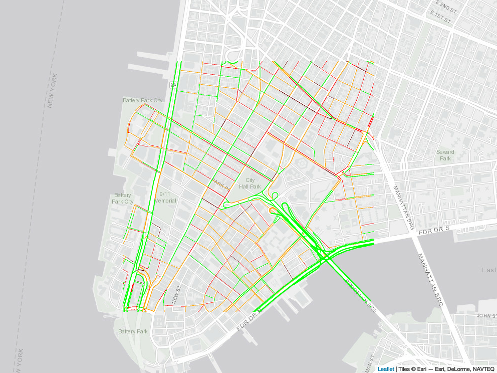

# googletraffic
Create data from Google Maps Traffic

# Overview

Google Maps Traffic provides valuable information about traffic conditions across an area. Google traffic is typically displayed as an interactive map; however, researchers interested in using the traffic information as data (e.g., merging traffic information with other data sources, observing trends over time, etc) require the traffic in a georeferenced data format. This package provides functions to produce georeferenced rasters from live Google Maps traffic information. Georeferenced rasters include up to four values indicating the level of traffic at the pixel location, as described in the below table:

| Google Traffic Color | Description | Raster Value |
| -------------------- | ----------- | ------------ |
| Green                | No traffic       | 1       |
| Orange               | Light traffic    | 2       |
| Red                  | Moderate traffic | 3       |
| Dark Red             | Heavy traffic    | 4       |

# Installation

```r  
# install.packages("devtools")
devtools::install_github("dime-worldbank/googletraffic")
```

# Examples

## Raster from lat/lon

The `gt_make_raster` function produces a raster, using a centroid location and height/width to specify the location where data is queried. The height/width are in terms of pixels, where pixel size primarily depends on the [zoom level](https://wiki.openstreetmap.org/wiki/Zoom_levels). For example, with a zoom level 13, each pixel will be about 20 meters (at the equator); with a zoom level of 16, each pixel will be about 2.5 meters (at the equator). Consequently, larger zoom values will give a more granular depiction of a location (e.g., for small streets within a city).

The function captures traffic information that originally appears on an interactive map produced from Google; for large values of `height` and `width`, the traffic information can take some time to render on the map. Consequently, a delay (specified using `webshot_delay`) is introduced to ensure traffic information is fully rendered on the map before the map is transformed into data. The below example uses a delay time of 2 seconds. For a height/width of 5000, a delay of 20 seconds may need to be used.

```r  
r <- gt_make_raster(location      = c(-1.286389, 36.817222),
                    height        = 500,
                    width         = 500,
                    zoom          = 16,
                    webshot_delay = 2,
                    google_key    = google_key)
```



## Raster from grid
```r  
nbo <- getData('GADM', country='KEN', level=1, path = "~/Desktop")
nbo <- nbo[nbo$NAME_1 %in% "Nairobi",]

grid_param_df <- gt_make_point_grid(polygon   = nbo,
                                    height    = 500,
                                    width     = 500,
                                    zoom      = 12,
                                    reduce_hw = 100)

r <- gt_make_raster_from_grid(grid_param_df = grid_param_df,
                              webshot_delay = 5,
                              google_key    = google_key)
```

## Raster from polygon
```r  
r <- gt_make_raster(location      = c(-1.286389, 36.817222),
                    height        = 500,
                    width         = 500,
                    zoom          = 16,
                    webshot_delay = 2)

nbo <- getData('GADM', country='KEN', level=1, path = "~/Desktop")
nbo <- nbo[nbo$NAME_1 %in% "Nairobi",]

r <- gt_make_raster_from_polygon(polygon       = nbo,
                                 height        = 500,
                                 width         = 500,
                                 zoom          = 12,
                                 webshot_delay = 5,
                                 reduce_hw     = 100,
                                 google_key    = google_key)
```
