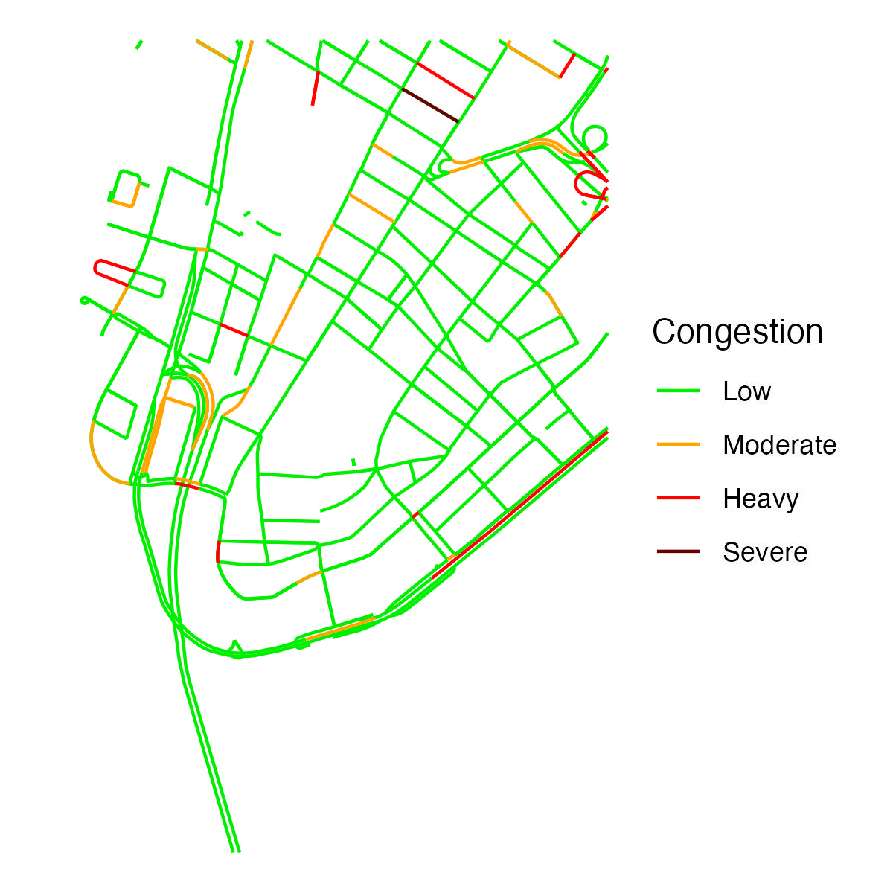
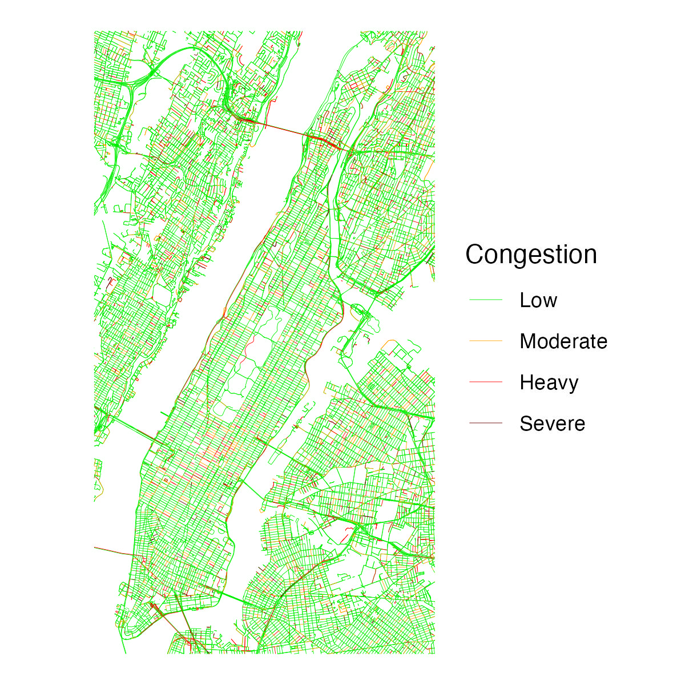

# googletraffic  

<!-- badges: start -->

[](https://cran.r-project.org/package=googletraffic)
[](https://github.com/dime-worldbank/googletraffic/actions/workflows/R-CMD-check.yaml)

<!-- badges: end -->
  
Create Georeferenced Traffic Data from the [Google Maps Javascript API](https://developers.google.com/maps/documentation/javascript/trafficlayer)

* [Overview](#overview)
* [Installation](#installation)
* [API Key](#apikey)
* [Quick Start](#quickstart)
* [Usage](#usage)
* [Alternatives to Google Maps](#alternatives)

## Overview <a name="overview"></a>

Google Maps [displays information about traffic conditions](https://www.google.com/maps/@38.909083,-77.0249335,12.07z/data=!5m1!1e1) across an area. This package provides functions to produce georeferenced rasters from real-time Google Maps traffic information. Having Google traffic information in a georeferenced data format facilitates analysis of traffic information (e.g., spatially merging traffic information with other data sources). 

This package was inspired by (1) existing research that has used Google traffic information, including in [New York City](https://www.sciencedirect.com/science/article/pii/S0048969721034070) and [Dar es Salaam](https://openknowledge.worldbank.org/handle/10986/33445), and (2) similar algorithms implemented in [JavaScript](https://ieeexplore.ieee.org/abstract/document/8326831) and in a [C shell script](https://arxiv.org/abs/2105.12235).

<!--- The below image shows an example raster produced using the package showing [traffic within Washington, DC.](https://www.google.com/maps/@38.9098813,-77.0406205,15.01z/data=!5m1!1e1)

<p align="center">

</p>
--->

Pixel values in rasters are derived from Google traffic colors and can be one of four values:

| Google Traffic Color | Description | Raster Value |
| -------------------- | ----------- | ------------ |
| Green                | No traffic delays | 1      |
| Orange               | Medium traffic    | 2      |
| Red                  | High traffic    | 3      |
| Dark Red             | Heavy traffic     | 4      |

## Installation <a name="installation"></a>

The package can be installed via CRAN.

```r  
install.packages("googletraffic")
```

To install the development version from Github:

```r
# install.packages("devtools")
devtools::install_github("dime-worldbank/googletraffic")
```

## API Key <a name="apikey"></a>

Querying Google traffic information requires a Google API key with the [Maps Javascript API](https://developers.google.com/maps/documentation/javascript/overview) enabled. To create a Google API key, [follow these instructions](https://developers.google.com/maps/get-started#create-project).

## Quickstart <a name="quickstart"></a>

### Setup <a name="setup"></a>
```r  
## Load package
library(googletraffic)

## Load additional packages to run below examples
library(ggplot2)
library(dplyr)
library(raster)

## Set API key
google_key <- "GOOGLE-KEY-HERE"
```

### Raster around point <a name="point"></a>
To create a raster around a point, we set the centroid coordinate, the [zoom](https://wiki.openstreetmap.org/wiki/Zoom_levels) level, and the height/width around the centroid coordinate (height/width are in terms of pixels, and kilometer distance of a pixel is determined primarily by the zoom level).

```r  
## Make raster
r <- gt_make_raster(location   = c(40.712778, -74.006111),
                    height     = 2000,
                    width      = 2000,
                    zoom       = 16,
                    google_key = google_key)

## Plot
r_df <- rasterToPoints(r, spatial = TRUE) %>% as.data.frame()
names(r_df) <- c("value", "x", "y")

ggplot() +
  geom_raster(data = r_df, 
  aes(x = x, y = y, 
  fill = as.factor(value))) +
  labs(fill = "Traffic\nLevel") +
  scale_fill_manual(values = c("green2", "orange", "red", "#660000")) +
  coord_quickmap() + 
  theme_void() +
  theme(plot.background = element_rect(fill = "white", color="white"))
```

<p align="center">

</p>

### Raster around polygon <a name="polygon"></a>
We can also create a raster using a polygon to define the location. If needed, the function will make multiple API calls to cover the area within the polygon (a larger `zoom` value will result in needing to make more API calls).

<!--By default, the function will use a height and width of 2000 (pixels) for each API call; if needed, the function will make multiple API calls to cover the area within the polygon. If the same number of API calls can be made using a smaller height and width, the function will use a smaller height and width. However, the height/width can also be manually specified using the `height` and `width` parameters. Larger height/width mean less API calls are needed, but traffic data will fail to render if too large of a height/width are set.-->

```r
## Grab shapefile of Manhattan
us_sp <- getData('GADM', country='USA', level=2)
ny_sp <- us_sp[us_sp$NAME_2 %in% "New York",]

## Make raster
r <- gt_make_raster_from_polygon(polygon    = ny_sp,
                                 zoom       = 16,
                                 google_key = google_key)

## Plot
r_df <- rasterToPoints(r, spatial = TRUE) %>% as.data.frame()
names(r_df) <- c("value", "x", "y")

ggplot() +
  geom_raster(data = r_df, 
  aes(x = x, y = y, 
  fill = as.factor(value))) +
  labs(fill = "Traffic\nLevel") +
  scale_fill_manual(values = c("green2", "orange", "red", "#660000")) +
  coord_quickmap() + 
  theme_void() +
  theme(plot.background = element_rect(fill = "white", color="white"))
```

<p align="center">

</p>

## Usage <a name="usage"></a>

See [this vignette](https://dime-worldbank.github.io/googletraffic/articles/googletraffic-vignette.html) for additional information and examples illustrating how to use the package.

## Alternatives to Google Maps traffic information <a name="alternatives"></a>

Google Maps is one of many sources that shows traffic information. One alternative source is Mapbox, which provides [vector tilesets](https://docs.mapbox.com/data/tilesets/reference/mapbox-traffic-v1/) that---similar to Google---show four levels of live traffic. The [mapboxapi](https://walker-data.com/mapboxapi/index.html) package provides a convenient way to obtain traffic information from Mapbox as `sf` polylines using the [get_vector_tiles](https://www.rdocumentation.org/packages/mapboxapi/versions/0.2/topics/get_vector_tiles) function. The function requires a Mapbox API key, which can be obtained [here](https://account.mapbox.com/auth/signup/).

They key differences between traffic information from the `mapboxapi` and `googletraffic` packages are that:

* `googletraffic` provides data in raster format, while `mapboxapi` provides data as polylines
* To cover traffic over large areas, `googletraffic` can require significantly less API calls compared to `mapboxapi`

Below is an example querying traffic information from Mapbox:

```r
## Load package
library(mapboxapi)
library(sf)

## Set API key
mapbox_key <- "MAPBOX-KEY-HERE"

## Query Data
nyc_cong_point <- get_vector_tiles(
  tileset_id = "mapbox.mapbox-traffic-v1",
  location = c(-74.006111, 40.712778), # c(longitude, latitude)
  zoom = 14,
  access_token = key
)$traffic$lines

#### Plot Data
nyc_cong_point %>%
  mutate(congestion = congestion %>% 
           tools::toTitleCase() %>%
           factor(levels = c("Low", "Moderate", "Heavy", "Severe"))) %>%
ggplot() +
  geom_sf(data = nyc_cong_point, aes(color = congestion)) +
  scale_color_manual(values = c("green2", "orange", "red", "#660000")) +
  labs(color = "Congestion") +
  theme_void() +
  theme(plot.background = element_rect(fill = "white", color="white"))
```

<p align="center">

</p>

Like `gt_make_raster()`, `get_vector_tiles` uses a latitude, longitude, and zoom level as input. `get_vector_tiles` does not have parameters to define the number of pixels the map covers. However, `get_vector_tiles` also accepts an `sf` polygon, where multiple queries are made to cover the bounding box of the polygon. 

The below example shows querying data for all of Manhattan. One key difference between using Mapbox and Google Maps is that `get_vector_tiles` requires 66 queries to cover Manhattan, while `gt_make_raster_from_polygon` requires 5 queries.

```r
## Grab shapefile of Manhattan
us_sp <- getData('GADM', country='USA', level=2)
ny_sp <- us_sp[us_sp$NAME_2 %in% "New York",]
ny_sf <- ny_sp %>% st_as_sf()

## Query traffic data
nyc_cong_poly <- get_vector_tiles(
  tileset_id = "mapbox.mapbox-traffic-v1",
  location = ny_sf,
  zoom = 14,
  access_token = key
)$traffic

## Map
nyc_cong_poly <- nyc_cong_poly %>%
  mutate(congestion = congestion %>% 
           tools::toTitleCase() %>%
           factor(levels = c("Low", "Moderate", "Heavy", "Severe")))

ggplot() +
  geom_sf(data = nyc_cong_poly, aes(color = congestion),
          size = 0.1) +
  scale_color_manual(values = c("green2", "orange", "red", "#660000")) +
  labs(color = "Congestion") +
  theme_void() +
  theme(plot.background = element_rect(fill = "white", color="white"))
```

<p align="center">

</p>

In addition to providing vector-based data on traffic levels, Mapbox also provides information on [typical and live traffic speeds](https://www.mapbox.com/traffic-data). Obtaining this speed information requires Mapbox Enterprise access.


