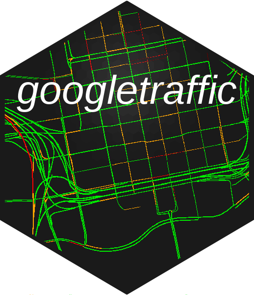
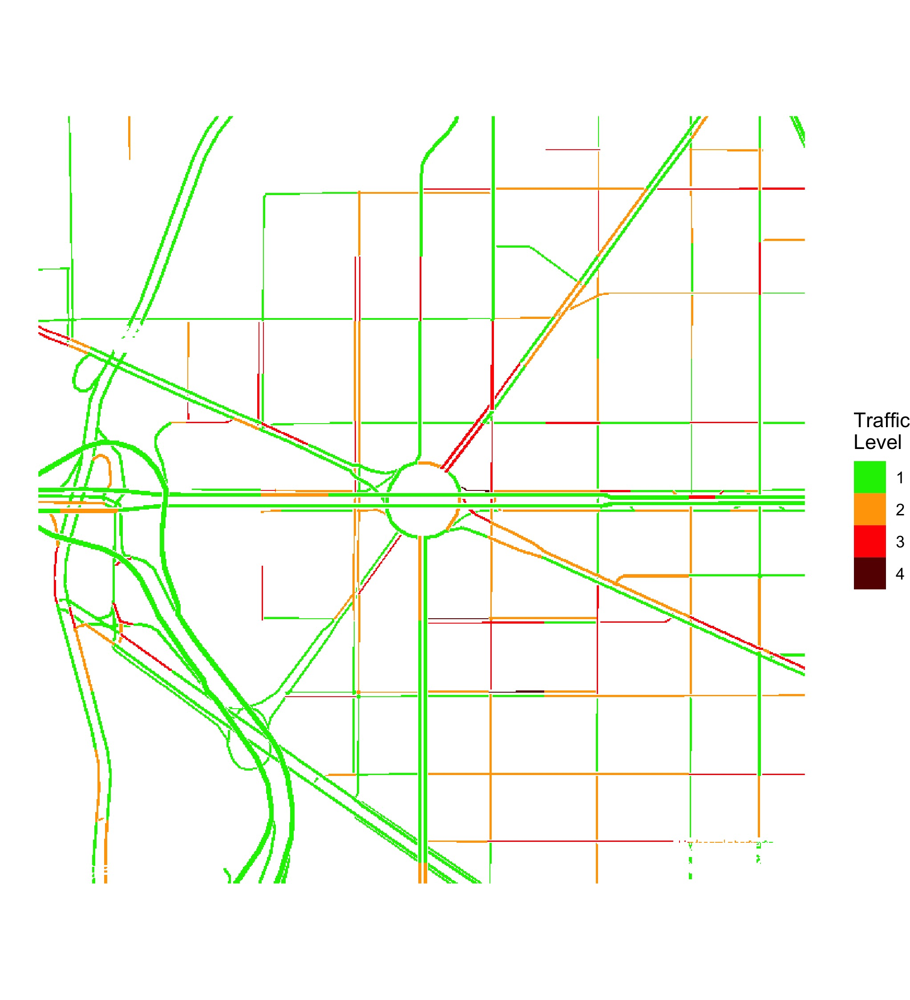
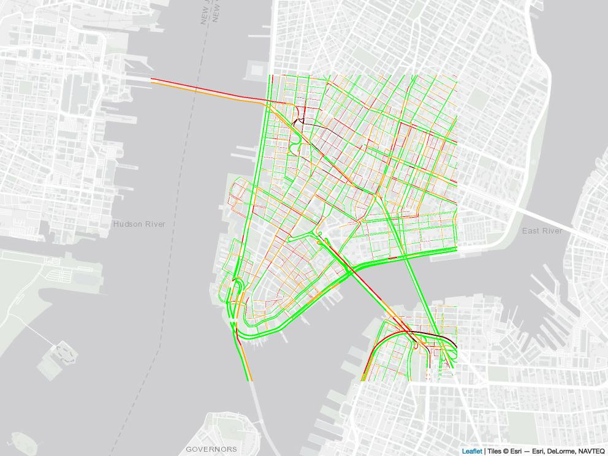
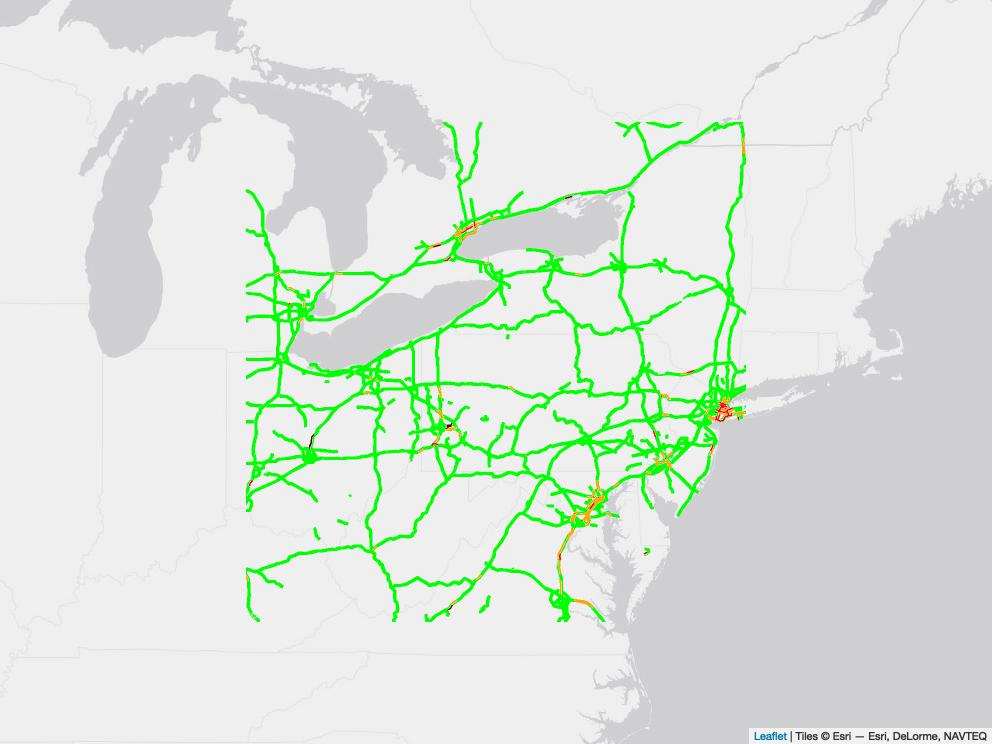
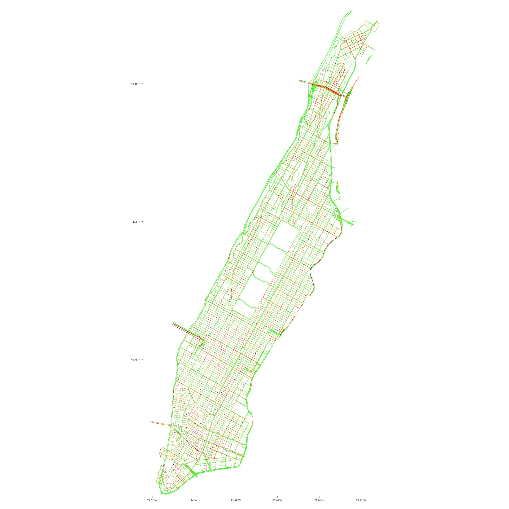
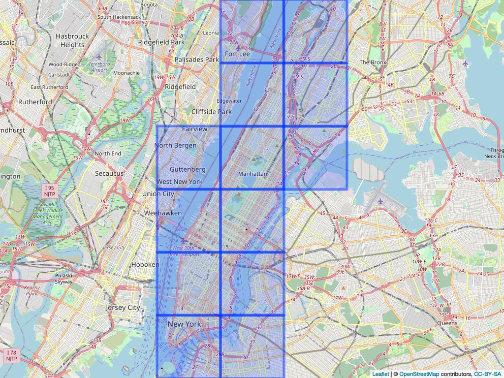
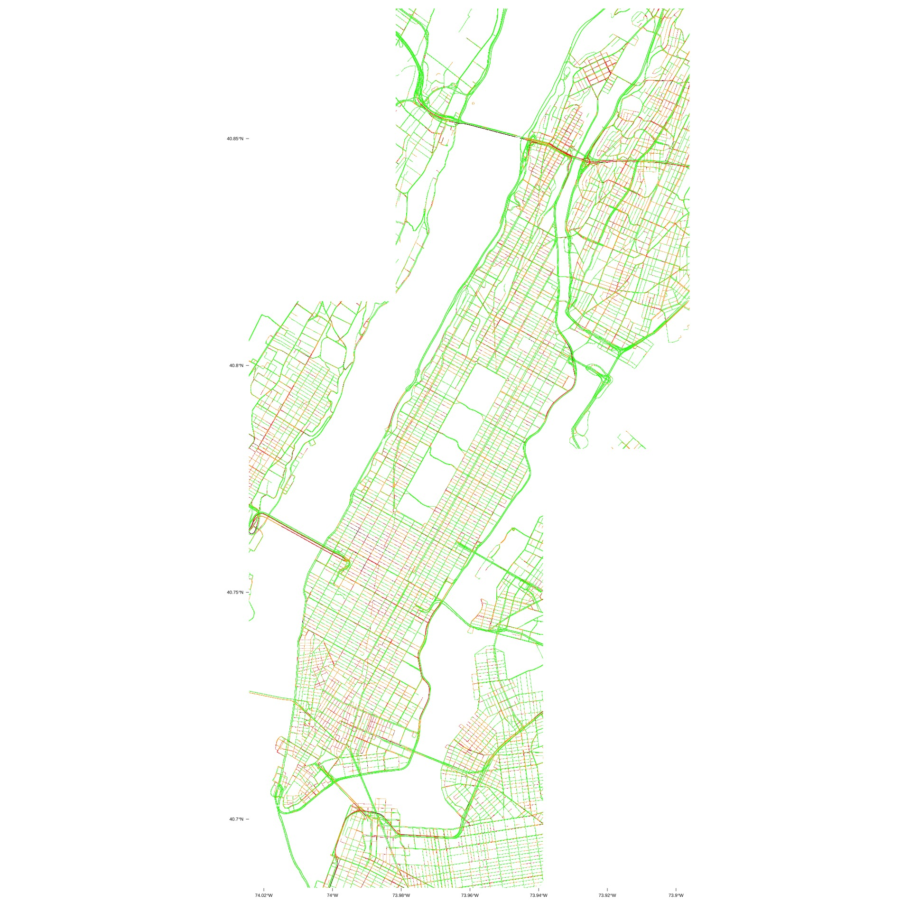

# googletraffic  
Create traffic data from the [Google Maps Javascript API](https://developers.google.com/maps/documentation/javascript/trafficlayer) Traffic Layer

* [Overview](#overview)
* [Installation](#installation)
* [Google API Key](#google-api-key)
* [Quickstart](#quickstart)

# Overview <a name="overview"></a>

Google Maps provides information about traffic conditions across an area. This package provides functions to produce georeferenced rasters from live Google Maps traffic information. Providing Google traffic information in a georeferenced data format facilitates analysis of traffic information (e.g., spatially merging traffic information with other data sources, observing trends over time, etc).

The below image shows an example raster produced using the package showing [traffic in Washington, DC.](https://www.google.com/maps/@38.9022138,-77.0505589,16.81z/data=!5m1!1e1)

<p align="center">

</p>

Pixel values in rasters are derived from Google [traffic colors](https://support.google.com/maps/answer/3092439?hl=en&co=GENIE.Platform%3DDesktop#zippy=%2Ctraffic) can be one of four values:

| Google Traffic Color | Description | Raster Value |
| -------------------- | ----------- | ------------ |
| Green                | No traffic delays | 1      |
| Orange               | Medium traffic    | 2      |
| Red                  | High traffic    | 3      |
| Dark Red             | Heavy traffic     | 4      |

# Installation <a name="installation"></a>

The package is available via github and can be installed using `devtools`.

```r  
# install.packages("devtools")
devtools::install_github("dime-worldbank/googletraffic")
```

# Google API Key <a name="google-api-key"></a>

Querying Google traffic information requires a Google API key with the [Maps Javascript API](https://developers.google.com/maps/documentation/javascript/overview) enabled. To create a Google API key, [follow these instructions](https://developers.google.com/maps/get-started#create-project).

# Quickstart <a name="quickstart"></a>

The package enables querying Google traffic information around a specific location and for larger spatial extents. In this section, key parameters relevant across functions are defined; then examples are shown querying traffic around a point, polygon, and grid.

* [Key parameters](#key-parameters)
* [Query Traffic Around a Specific Location: `gt_make_raster()`](#raster-from-location)
* [Query Granular Traffic Information for Large Spatial Extent](#large-extent)
  - [Query Traffic From a Polygon: `gt_make_raster_from_polygon()`](#raster-from-polygon)
  - [Query Traffic From a Grid: `gt_make_raster_from_grid()`](#raster-from-grid)

To run the below examples, the following code should be run first.
```r
## Load Google Traffic package
library(googletraffic)

## Load packages for visualizing data
library(leaflet)
library(leaflet.extras)
library(leaflet.providers)
library(scales)
library(mapview)

## Set Google API Key
google_key <- "GOOGLE-API-KEY-HERE"
```

## Key parameters <a name="key-parameters"></a>

The following are key parameters used when querying Google Traffic data.

* __zoom:__ The [zoom level](https://wiki.openstreetmap.org/wiki/Zoom_levels) defines the resolution of the traffic image. Values can range from 0 to 20. At the equator, with a zoom level 10, each pixel will be about 150 meters; with a zoom level 20, each pixel will be about 0.15 meters. Consequently, smaller zoom levels can be used if only larger roads are of interest (e.g., highways), while larger zoom levels will be needed for capturing smaller roads.
* __height/width:__ The `height` and `width` parameters define the height and width of the raster in terms of pixels. The kilometer height/width of pixels depends primarily on the `zoom` level.
<!---
* __webshot_delay:__ Google maps information is originally rendered on an interactive map. For large values of `height` and `width`, traffic information can take some time to render on a map. Consequently, a delay (specified using `webshot_delay`) is introduced to ensure traffic information is fully rendered on the map before traffic data is extracted. For example, when using a `height` and `width` of 500, a delay time of 2 seconds works well. For a `height` and `width` of 5000, a delay of up to 20 seconds may be needed. Traffic information cannot be rendered for very large `height` and `width` values, no matter the `webshot_delay` specified.
  - __Note that `webshot_delay` does not need to be specified.__ If it is not specified, the function estimates an appropriate delay length given the `height` and `width`. However, `webshot_delay` can be manually specified to (1) attempt to make faster queries or (2) or introduce longer delays if traffic information fails to render.
--->

## Raster Around a Specific Location <a name="raster-from-location"></a>

The `gt_make_raster()` function produces a raster, using a centroid location and a height/width around the centroid to specify the location to query traffic information. The below example queries traffic for lower Manhattan, NYC.

```r  
## Make raster
r <- gt_make_raster(location   = c(40.712778, -74.006111),
                    height     = 1000,
                    width      = 1000,
                    zoom       = 16,
                    google_key = google_key)

## Map raster
pal <- colorNumeric(c("green", "orange", "red", "#660000"), values(r),
                        na.color = "transparent")

leaflet() %>%
  addProviderTiles("Esri.WorldGrayCanvas") %>%
  addRasterImage(r, colors = pal, opacity = 1)
```

<p align="center">

</p>

By using a smaller `zoom`, we can capture a larger area.
```r  
## Make raster
r <- gt_make_raster(location   = c(41.384900, -78.891302),
                    height     = 1000,
                    width      = 1000,
                    zoom       = 7,
                    google_key = google_key)

## Map raster
pal <- colorNumeric(c("green", "orange", "red", "#660000"), values(r),
                        na.color = "transparent")

leaflet() %>%
  addProviderTiles("Esri.WorldGrayCanvas") %>%
  addRasterImage(r, colors = pal, opacity = 1)
```

<p align="center">

</p>

## Query Granular Traffic Information for Large Spatial Extent <a name="large-extent"></a>

__The above example illustrates a trade off between resolution and spatial extent.__ For small `zoom` levels, we can capture large areas, but the pixels values are also large --- so we may only be able to detect overall traffic for large roads or cities. For large `zoom` levels, we can detect traffic on specific roads, but can only capture traffic for a smaller area. We could set a large `zoom` and a large `height` and `width`, but Google traffic information will fail to render if we set the `height` and `width` values too large.

__The package provides functions that allow querying granular traffic information for large spatial extents.__ Here, we make multiple queries to obtain traffic information for multiple areas, then the information is merged together into one raster file. The `gt_make_raster_from_polygon()` and `gt_make_raster_from_grid()` provide two different approaches for querying granular traffic information for spatial extents where multiple Google API queries are needed.

### Raster from Polygon <a name="raster-from-polygon"></a>

The above example showed querying traffic information for lower Manhattan. Here, we show querying traffic information for all of Manhattan using the same resolution (a `zoom` level of 16, where each pixel is about 2 meters long). Using the `gt_make_raster_from_polygon()`, we input a polygon of Manhattan. We still specify the `height` and `width`, which determines the height and width used for a single Google API query. Large `height` and `width` values will result in fewer Google queries, while smaller `height` and `width` values will require more queries to cover the same spatial area.

In the below example, we use a `height` and `width` of 2000, which results in needing to make 14 Google API queries to cover all of Manhattan.

```r  
## Grab polygon of Manhattan
us_sp <- getData('GADM', country='USA', level=2)
ny_sp <- us_sp[us_sp$NAME_2 %in% "New York",]

## Make raster
r <- gt_make_raster_from_polygon(polygon    = ny_sp,
                                 height     = 2000,
                                 width      = 2000,
                                 zoom       = 16,
                                 google_key = google_key)

## Plot raster
r_df <- rasterToPoints(r, spatial = TRUE) %>% as.data.frame()
names(r_df) <- c("value", "x", "y")

ggplot() +
  geom_raster(data = r_df,
              aes(x = x, y = y,
                  fill = as.factor(value))) +
  labs(fill = "Traffic\nLevel") +
  scale_fill_manual(values = c("green2", "orange", "red", "#660000")) +
  coord_quickmap() +
  theme_void()
```

<p align="center">

</p>

### Raster from Grid <a name="raster-from-grid"></a>

`gt_make_raster_from_polygon()` creates a grid that covers a polygon, creates a traffic raster for each grid, and merges the rasters together. Some may prefer to first create and see the grid, then create a traffic raster using this grid. For example, one could (1) create a grid that covers a polygon then (2) remove certain grid tiles that cover areas that may not be of interest. The `gt_make_grid()` and `gt_make_raster_from_grid()` functions facilitate this process; `gt_make_grid()` creates a grid, then `gt_make_raster_from_grid()` uses a grid as an input to create a traffic raster.

First, we create a grid using `gt_make_grid()`.
```r
grid_df <- gt_make_grid(polygon = ny_sp,
                        height  = 2000,
                        width   = 2000,
                        zoom    = 16)

leaflet() %>%
  addTiles() %>%
  addPolygons(data = grid_df)
```

<p align="center">

</p>

We notice that the tile in the bottom left corner just covers water and some land outside of Manhattan. To reduce the number of API queries we need to make, we can remove this tile.

```r
grid_clean_df <- grid_df[-12,]

leaflet() %>%
  addTiles() %>%
  addPolygons(data = grid_clean_df)
```

<p align="center">

</p>

Second, we use the grid to make a traffic raster using `gt_make_raster_from_grid()`.
```r
## Make raster
r <- gt_make_raster_from_grid(grid_param_df = grid_clean_df,
                              google_key    = google_key)

## Plot raster
r_df <- rasterToPoints(r, spatial = TRUE) %>% as.data.frame()
names(r_df) <- c("value", "x", "y")

ggplot() +
  geom_raster(data = r_df,
              aes(x = x, y = y,
                  fill = as.factor(value))) +
  labs(fill = "Traffic\nLevel") +
  scale_fill_manual(values = c("green2", "orange", "red", "#660000")) +
  coord_quickmap() +
  theme_void()
```

<p align="center">

</p>

Note that the above raster includes traffic in areas outside of Manhattan; the image is not masked to just the Manhattan polygon. This result can also be achieved when using the `gt_make_raster_from_polygon()` function by setting `mask_to_polygon` to `FALSE`.
