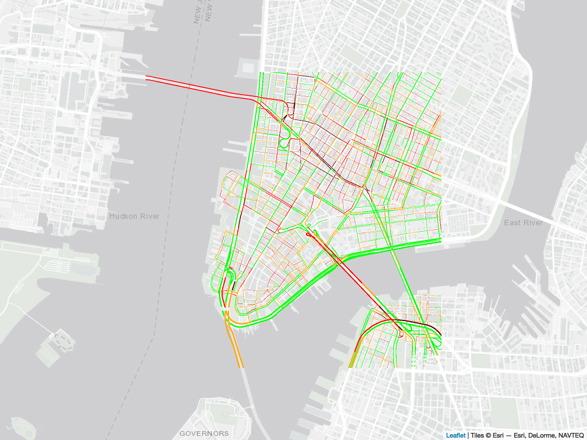
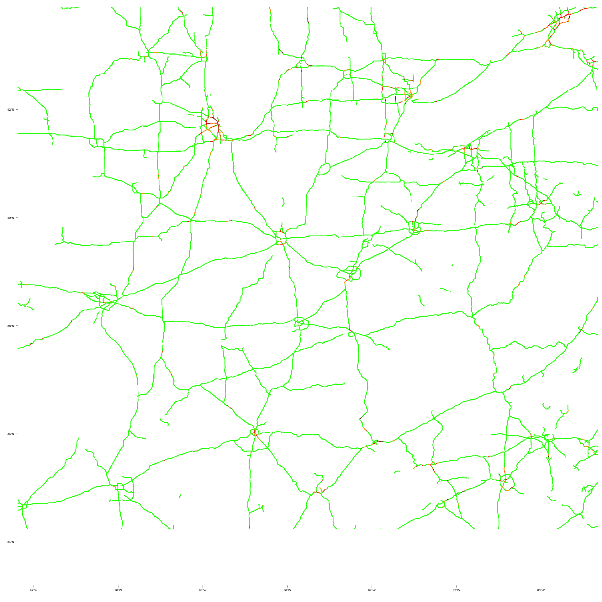
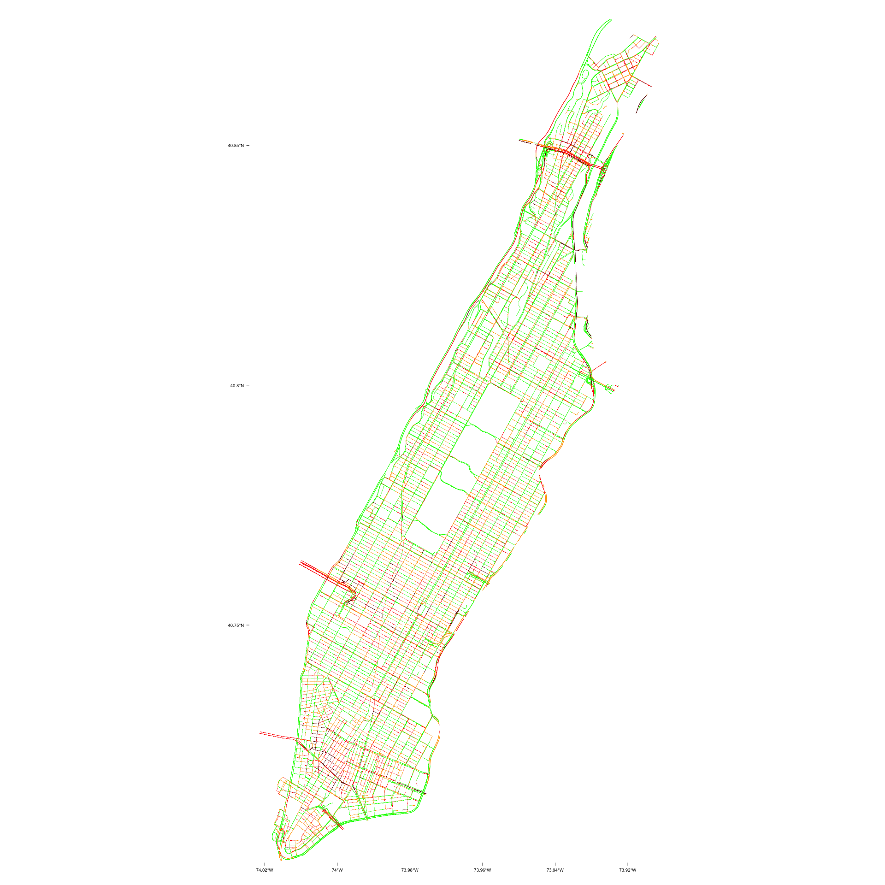
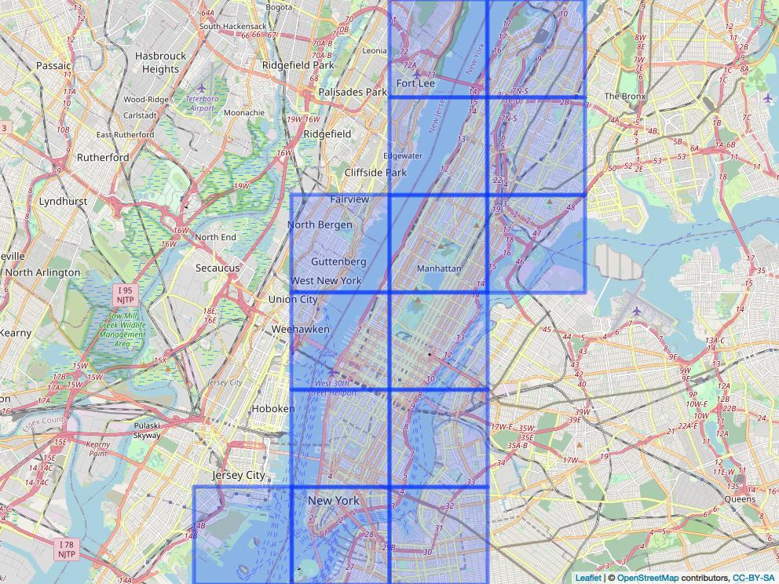
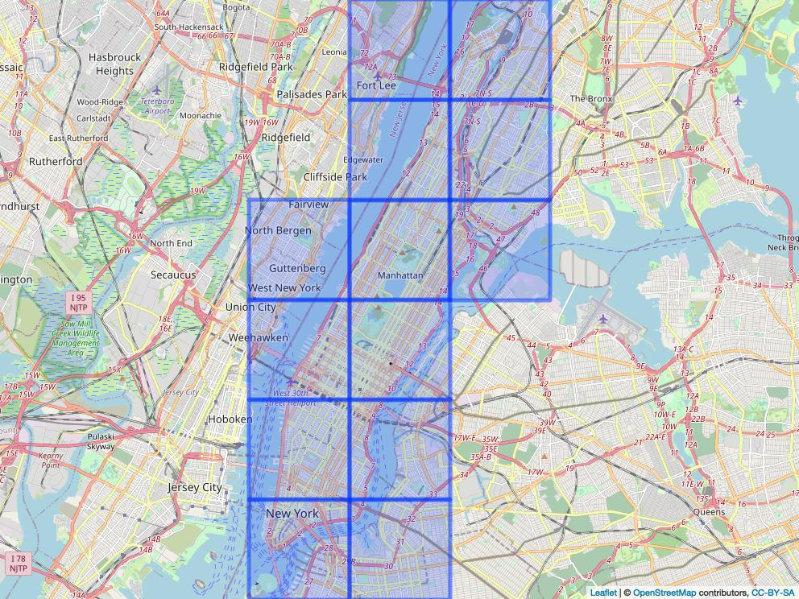
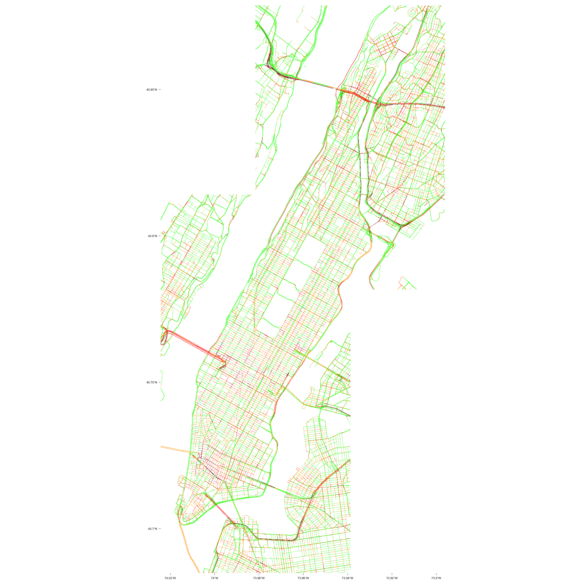

# googletraffic
Create data from Google Maps Traffic

# Overview

Google Maps Traffic provides valuable information about traffic conditions across an area. Google traffic is typically displayed as an interactive map; however, researchers interested in using the traffic information as data (e.g., merging traffic information with other data sources, observing trends over time, etc) require the traffic in a georeferenced data format. This package provides functions to produce georeferenced rasters from live Google Maps traffic information. Georeferenced rasters include up to four values indicating the level of traffic at the pixel location, as described in the below table:

| Google Traffic Color | Description | Raster Value |
| -------------------- | ----------- | ------------ |
| Green                | No traffic       | 1       |
| Orange               | Light traffic    | 2       |
| Red                  | Moderate traffic | 3       |
| Dark Red             | Heavy traffic    | 4       |

# Installation

```r  
# install.packages("devtools")
devtools::install_github("dime-worldbank/googletraffic")
```

# Google API Key

Querying Google traffic information requires a Google API key with the [Maps Javascript API](https://developers.google.com/maps/documentation/javascript/overview) enabled.

```r
# The functions that query Google traffic information require a Google API key.
google_key <- "GOOGLE-KEY-HERE"
```

# Examples

## Raster around lat/lon

The `gt_make_raster` function produces a raster, using a centroid location and height/width to specify the location where data is queried. The height/width are in terms of pixels, where pixel size primarily depends on the [zoom level](https://wiki.openstreetmap.org/wiki/Zoom_levels). For example, with a zoom level 13, each pixel will be about 20 meters (at the equator); with a zoom level of 16, each pixel will be about 2.5 meters (at the equator). Consequently, larger zoom values will give a more granular depiction of a location (e.g., for small streets within a city).

The function captures traffic information that originally appears on an interactive map produced from Google; for large values of `height` and `width`, the traffic information can take some time to render on the map. Consequently, a delay (specified using `webshot_delay`) is introduced to ensure traffic information is fully rendered on the map before the map is transformed into data. The below example uses a delay time of 2 seconds. For a height/width of 5000, a delay of up to 20 seconds may need to be used.

The below example shows traffic in lower Manhattan, NYC.
```r  
## Make raster
r <- gt_make_raster(location      = c(-1.286389, 36.817222),
                    height        = 500,
                    width         = 500,
                    zoom          = 16,
                    webshot_delay = 2,
                    google_key    = google_key)

## Map raster
pal <- colorNumeric(c("green", "orange", "red", "#660000"), values(r),
                        na.color = "transparent")

leaflet() %>%
  addProviderTiles("Esri.WorldGrayCanvas") %>%
  addRasterImage(r, colors = pal, opacity = 1,project=F)

```

<p align="center">

</p>

By using a smaller `zoom` and larger `height` and `width`, we can capture a larger area. Note that because we used a larger zoom, we also increased the `webshot_delay` time.
```r  
## Make raster
r <- gt_make_raster(location    = c(38.744324, -85.511534),
                  height        = 5000,
                  width         = 5000,
                  zoom          = 7,
                  webshot_delay = 20,
                  google_key    = google_key)

## Map raster
rasterVis::levelplot(r,
                     col.regions = c("green", "orange", "red", "#660000"),
                     par.settings = list(axis.line = list(col = "transparent")),
                     scales = list(col = "black"),
                     colorkey = F,
                     xlab = NULL,
                     ylab = NULL,
                     margin = F)
```

<p align="center">

</p>

## Raster from polygon

The above raster shows traffic across multiple U.S. states. However, the height/width of each pixel is over 300 meters; the above data may be useful if focusing on a larger scale (e.g., where a unit would be a city, not a road). To have high granularity and also cover a larger area, we could increase the `zoom` and further increase the `height` and `width`; however, traffic data will not render if the `height` and `width` are too large. Instead, we can increase the `zoom`, use a smaller `height` and `width`, and call the function across a grid that covers our study area. The `gt_make_raster_from_polygon()` facilitates this process; instead of specifying the centroid location, we can use a polygon; multiple rasters are created and mosaiced together to create a raster that covers the polygon.

In the first example, we captured traffic in lower Manhattan using a `zoom` of 15. Now, we create traffic data across all of Manhattan using the same zoom.

```r  
## Grab polygon
us_sp <- getData('GADM', country='USA', level=2)
ny_sp <- us_sp[us_sp$NAME_2 %in% "New York",]

## Make raster
r <- gt_make_raster_from_polygon(polygon       = ny_sp,
                                 height        = 2000,
                                 width         = 2000,
                                 zoom          = 16,
                                 webshot_delay = 10,
                                 google_key    = google_key)

## Plot raster
rasterVis::levelplot(r,
                     col.regions = c("green", "orange", "red", "#660000"),
                     par.settings = list(axis.line = list(col = "transparent")),
                     scales = list(col = "black"),
                     colorkey = F,
                     xlab = NULL,
                     ylab = NULL,
                     margin = F)
```

<p align="center">

</p>

## Raster from Grid

`gt_make_raster_from_polygon()` creates a grid that covers a polygon, creates a traffic raster for each grid, and mosaics them together. Some may prefer to first create and see the grid, then create a traffic raster using this grid. For example, one could (1) create a grid that covers a polygon then (2) remove certain grid tiles that cover areas that may not be of interest. The `gt_make_point_grid()` and `gt_make_raster_from_grid()` functions facilitate this process; `gt_make_point_grid()` creates a grid, then `gt_make_raster_from_grid()` uses a grid as an input to create a traffic raster.

Here, we create a grid.
```r
grid_df <- gt_make_point_grid(polygon = ny_sp,
                              height  = 2000,
                              width   = 2000,
                              zoom    = 16)

leaflet() %>%
  addTiles() %>%
  addPolygons(data = grid_df)
```

<p align="center">

</p>

We notice that the tile in the bottom left corner just covers water and some land outside of Manhattan (the Manhattan polygon includes water area). To reduce the number of API queries we need to make, we can remove this tile.

```r
grid_clean_df <- grid_df[-12,]

leaflet() %>%
  addTiles() %>%
  addPolygons(data = grid_clean_df)
```

<p align="center">

</p>

We can then use the grid to make a traffic raster.
```r
r <- gt_make_raster_from_grid(grid_param_df = grid_clean_df,
                              webshot_delay = 10,
                              google_key = google_key)

rasterVis::levelplot(r,
                     col.regions = c("green", "orange", "red", "#660000"),
                     par.settings = list(axis.line = list(col = "transparent")),
                     scales = list(col = "black"),
                     colorkey = F,
                     xlab = NULL,
                     ylab = NULL,
                     margin = F)
```

<p align="center">

</p>

Note that the above raster includes traffic in areas outside of Manhattan; the image is not cropped or masked to just the Manhattan polygon. This result can also be achieved when using the `gt_make_raster_from_polygon()` function by setting `crop_to_polygon` to `FALSE`.
