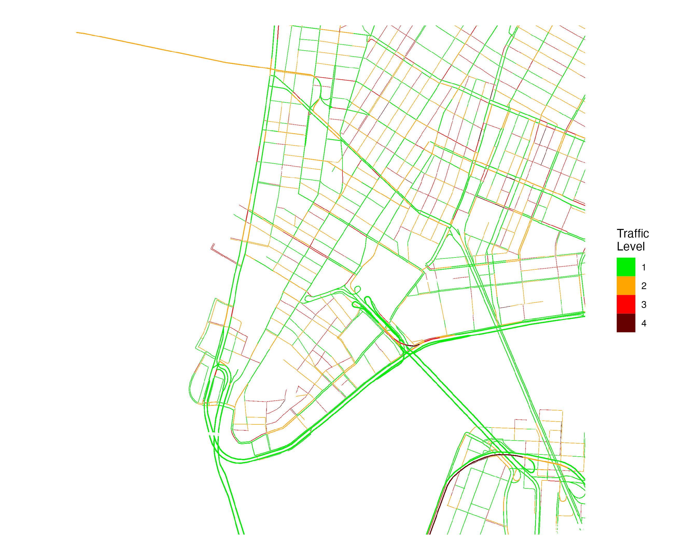

# googletraffic  
Create Georeferenced Traffic Data from the [Google Maps Javascript API](https://developers.google.com/maps/documentation/javascript/trafficlayer)

* [Overview](#overview)
* [Installation](#installation)
* [API Key](#apikey)
* [Quick Start](#quickstart)
* [Usage](#usage)

## Overview <a name="overview"></a>

Google Maps [displays information about traffic conditions](https://www.google.com/maps/@38.909083,-77.0249335,12.07z/data=!5m1!1e1) across an area. This package provides functions to produce georeferenced rasters from live Google Maps traffic information. Having Google traffic information in a georeferenced data format facilitates analysis of traffic information (e.g., spatially merging traffic information with other data sources).

<!--- The below image shows an example raster produced using the package showing [traffic within Washington, DC.](https://www.google.com/maps/@38.9098813,-77.0406205,15.01z/data=!5m1!1e1)

<p align="center">

</p>
--->

Pixel values in rasters are derived from Google traffic colors and can be one of four values:

| Google Traffic Color | Description | Raster Value |
| -------------------- | ----------- | ------------ |
| Green                | No traffic delays | 1      |
| Orange               | Medium traffic    | 2      |
| Red                  | High traffic    | 3      |
| Dark Red             | Heavy traffic     | 4      |

## Installation <a name="installation"></a>

The package is available via github and can be installed using `devtools`.

```r  
# install.packages("devtools")
devtools::install_github("dime-worldbank/googletraffic")
```

## API Key <a name="apikey"></a>

Querying Google traffic information requires a Google API key with the [Maps Javascript API](https://developers.google.com/maps/documentation/javascript/overview) enabled. To create a Google API key, [follow these instructions](https://developers.google.com/maps/get-started#create-project).

## Quickstart <a name="quickstart"></a>

### Setup <a name="setup"></a>
```r  
## Load package
library(googletraffic)

## Load additional packages to run below examples
library(ggplot2)
library(dplyr)
library(raster)

## Set API key
google_key <- "GOOGLE-KEY-HERE"
```

### Raster around point <a name="point"></a>
To create a raster around a point, we set the centroid coordinate, the [zoom](https://wiki.openstreetmap.org/wiki/Zoom_levels) level, and the height/width around the centroid coordinate (height/width are in terms of pixels, and kilometer distance of a pixel is determined primarily by the zoom level).

```r  
## Make raster
r <- gt_make_raster(location   = c(40.712778, -74.006111),
                    height     = 2000,
                    width      = 2000,
                    zoom       = 16,
                    google_key = google_key)

## Plot
r_df <- rasterToPoints(r, spatial = TRUE) %>% as.data.frame()
names(r_df) <- c("value", "x", "y")

ggplot() +
  geom_raster(data = r_df, 
  aes(x = x, y = y, 
  fill = as.factor(value))) +
  labs(fill = "Traffic\nLevel") +
  scale_fill_manual(values = c("green2", "orange", "red", "#660000")) +
  coord_quickmap() + 
  theme_void() +
  theme(plot.background = element_rect(fill = "white", color="white"))
```

<p align="center">

</p>

### Raster around polygon <a name="polygon"></a>
We can also create a raster using a polygon to define the location. If needed, the function will make multiple API calls to cover the area within the polygon (a larger `zoom` value will result in needing to make more API calls).

<!--By default, the function will use a height and width of 2000 (pixels) for each API call; if needed, the function will make multiple API calls to cover the area within the polygon. If the same number of API calls can be made using a smaller height and width, the function will use a smaller height and width. However, the height/width can also be manually specified using the `height` and `width` parameters. Larger height/width mean less API calls are needed, but traffic data will fail to render if too large of a height/width are set.-->

```r
## Grab shapefile of Manhattan
us_sp <- getData('GADM', country='USA', level=2)
ny_sp <- us_sp[us_sp$NAME_2 %in% "New York",]

## Make raster
r <- gt_make_raster_from_polygon(polygon    = ny_sp,
                                 zoom       = 16,
                                 google_key = google_key)

## Plot
r_df <- rasterToPoints(r, spatial = TRUE) %>% as.data.frame()
names(r_df) <- c("value", "x", "y")

ggplot() +
  geom_raster(data = r_df, 
  aes(x = x, y = y, 
  fill = as.factor(value))) +
  labs(fill = "Traffic\nLevel") +
  scale_fill_manual(values = c("green2", "orange", "red", "#660000")) +
  coord_quickmap() + 
  theme_void() +
  theme(plot.background = element_rect(fill = "white", color="white"))
```

<p align="center">

</p>

## Usage <a name="usage"></a>

See [this vignette](https://dime-worldbank.github.io/googletraffic/articles/googletraffic-vignette.html) for additional information and examples illustrating how to use the package.


