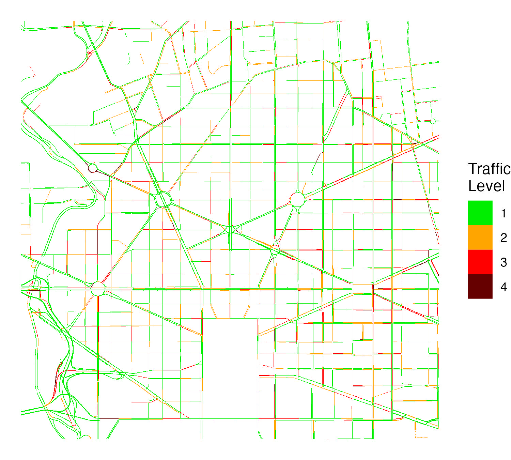

```{r init, include = FALSE}
knitr::opts_chunk$set(
  collapse = TRUE,
  comment = "#>"
)
```

## Overview <a name="overview"></a>

Google Maps displays information about traffic conditions across an area. This package provides functions to produce georeferenced rasters from real-time Google Maps traffic information. Having Google traffic information in a georeferenced data format facilitates analysis of traffic information (e.g., spatially merging traffic information with other data sources). 

This package was inspired by (1) existing research that has used Google traffic information, including in [New York City](https://www.sciencedirect.com/science/article/pii/S0048969721034070) and [Dar es Salaam](https://openknowledge.worldbank.org/handle/10986/33445), and (2) similar algorithms implemented in [JavaScript](https://ieeexplore.ieee.org/abstract/document/8326831) and in a [C shell script](https://arxiv.org/abs/2105.12235).

The below image shows an example raster produced using the package showing [traffic within Washington, DC.](https://www.google.com/maps/@38.9098813,-77.0406205,15.01z/data=!5m1!1e1)

<p align="center">

</p>

Pixel values in rasters are derived from Google traffic colors and can be one of four values:

| Google Traffic Color | Description | Raster Value |
| -------------------- | ----------- | ------------ |
| Green                | No traffic delays | 1      |
| Orange               | Medium traffic    | 2      |
| Red                  | High traffic    | 3      |
| Dark Red             | Heavy traffic     | 4      |

The package provides function to query Google traffic data around a location, within a polygon, or using a grid. The main functions are the following:

* [gt_make_raster()](#raster-point): Create googe traffic raster around a point
* [gt_make_raster_from_polygon()](#raster-polygon): Create googe traffic raster using a polygon
* [gt_make_grid()](#raster-grid): Create a grid (sf polygon) that defines locations to query traffic data
* [gt_make_raster_from_grid()](#raster-grid): Create googe traffic raster using a a grid

---

## Installation <a name="installation"></a>

The package can be installed via CRAN.

```r  
install.packages("googletraffic")
```

---

## Google API Key <a name="google-api-key"></a>

Querying Google traffic information requires a Google API key with the [Maps Javascript API](https://developers.google.com/maps/documentation/javascript/overview) enabled. To create a Google API key, [follow these instructions](https://developers.google.com/maps/get-started#create-project).

---

## Setup <a name="setup"></a>

The below code should be run before running the following examples. We load packages, set the Google API key, and define a palette used for visualizing traffic data in [leaflet](https://rstudio.github.io/leaflet/).

```{r setup_view, include=TRUE, warning=FALSE, message=FALSE, eval = FALSE}
## Load Google Traffic package
library(googletraffic)

## Load additional packages for working with and visualizing data
library(leaflet)
library(leaflet.providers)
library(raster)
library(dplyr)

## Set Google API Key
google_key <- "GOOGLE-API-KEY-HERE"

## Define Leaflet Palette and Legend
traffic_pal <- colorNumeric(c("green", "orange", "red", "#660000"), 
                            1:4,
                            na.color = "transparent")
```

```{r setup_use, include=FALSE}
## Load additional packages for working with and visualizing data
library(leaflet)
library(leaflet.providers)
library(raster)
library(dplyr)

## Define Leaflet Palette and Legend
traffic_pal <- colorNumeric(c("green", "orange", "red", "#660000"), 
                            1:4,
                            na.color = "transparent")
```

---

## Key parameters <a name="key-parameters"></a>

The following are key parameters relevant across functions for querying Google Traffic data.

* __zoom:__ The [zoom level](https://wiki.openstreetmap.org/wiki/Zoom_levels) defines the resolution of the traffic image. Values can range from 0 to 20. At the equator, with a zoom level 10, each pixel will be about 150 meters; with a zoom level 20, each pixel will be about 0.15 meters. Consequently, smaller zoom levels can be used if only larger roads are of interest (e.g., highways), while larger zoom levels will be needed for capturing smaller roads.
* __height/width:__ The `height` and `width` parameters define the height and width of the raster in terms of pixels. The kilometer height/width of pixels depends primarily on the zoom level (larger zoom levels correspond to the pixels having a smaller kilometer distance). 

__Large height/width and delay time:__ Google traffic data takes time to render on a map, and larger height and width values require more time for data to render. The functions automatically scale the delay time depending on the height and width values set, but the delay time can also be manually set using the `webshot_delay` parameter. Note that traffic data may fail to render for very large height and width values, no matter the `webshot_delay` set (we find that the function works well with a `height` and `width` of 2000 or less).

__Default height/width:__ In the `gt_make_raster_from_polygon()` and `gt_make_grid()` functions, `height` and `width` do not need to be set. The function will first test a height and width of 2000 for each API query to cover the region of interest, but if a smaller height and width can be used where the same number of API calls are made, a smaller height and width will be used. However, the height and width can still be manually set in these functions.

---

## Raster Around Point <a name="raster-point"></a>

The `gt_make_raster()` function produces a raster, using a centroid location and a height/width around the centroid to specify the location to query traffic information. The below example queries traffic for lower Manhattan, NYC.

```{r point_small_load, include=FALSE}
r <- readRDS("raster_point_small.Rds")
```

```{r point_small_raster, include=TRUE, warning=FALSE, message=FALSE, eval=FALSE}
## Make raster
r <- gt_make_raster(location   = c(40.712778, -74.006111),
                    height     = 1000,
                    width      = 1000,
                    zoom       = 16,
                    google_key = google_key)
```

```{r point_small_leaflet, include=TRUE, warning=FALSE, message=FALSE, eval=T}
## Map raster
leaflet(width = "100%") %>%
  addProviderTiles("Esri.WorldGrayCanvas") %>%
  addRasterImage(r, colors = traffic_pal, opacity = 1, method = "ngb") 
```

By using a smaller `zoom`, we can capture a larger area; however, the pixels are more coarse.

```{r point_large_load, include=FALSE}
r <- readRDS("raster_point_large.Rds")
```

```{r point_large_raster, include=TRUE, warning=FALSE, message=FALSE, eval=FALSE}
## Make raster
r <- gt_make_raster(location   = c(41.384900, -78.891302),
                    height     = 1000,
                    width      = 1000,
                    zoom       = 7,
                    google_key = google_key)
```

```{r point_large_leaflet, include=TRUE, warning=FALSE, message=FALSE, eval=T}
## Map raster
leaflet(width = "100%") %>%
  addProviderTiles("Esri.WorldGrayCanvas") %>%
  addRasterImage(r, colors = traffic_pal, opacity = 1, method = "ngb") %>%
  setView(lat = 41.384900, lng = -78.891302, zoom = 6) 
```

---

## Raster Around Polygon <a name="raster-polygon"></a>

The above example shows querying traffic information for lower Manhattan. In this example, we show querying traffic information for all of Manhattan while still using a relatively high zoom level (that allows capturing traffic on smaller streets). The `gt_make_raster_from_polygon()` accepts a polygon as an input; if needed, multiple API queries are made to query traffic for the full polygon.

<!--By default, a `height` and `width` of 2000 is used for each API call; however, (1) the function will use a smaller `height`/`width` if a smaller `height`/`width` results in the same number of API queries to cover the polygon, and (2) the `height` and `width` can still be manually specified using the `height` and `width` parameters.-->

```{r polygon_load, include=FALSE}
r <- readRDS("raster_polygon.Rds")
```

```{r polygon_raster, include=TRUE, warning=FALSE, message=FALSE, eval=FALSE}
## Grab polygon of Manhattan
us_sp <- getData('GADM', country='USA', level=2)
ny_sp <- us_sp[us_sp$NAME_2 %in% "New York",]

## Make raster
r <- gt_make_raster_from_polygon(polygon    = ny_sp,
                                 zoom       = 15,
                                 google_key = google_key)
```

```{r polygon_leaflet, include=TRUE, warning=FALSE, message=FALSE, eval=T}
## Map raster
leaflet(width = "100%") %>%
  addProviderTiles("Esri.WorldGrayCanvas") %>%
  addRasterImage(r, colors = traffic_pal, opacity = 1, method = "ngb") 
```

---

## Raster Using Grid <a name="raster-grid"></a>

Within `gt_make_raster_from_polygon()`, the function creates a grid that covers a polygon, creates a traffic raster for each grid, and merges the rasters together. Some may prefer to first create and see the grid, then create a traffic raster using this grid. For example, one could (1) create a grid that covers a polygon then (2) remove certain grid tiles that cover areas that may not be of interest. The `gt_make_grid()` and `gt_make_raster_from_grid()` functions facilitate this process; `gt_make_grid()` creates a grid, then `gt_make_raster_from_grid()` uses a grid as an input to create a traffic raster.

First, we create a grid using `gt_make_grid()`. 

```{r grid_1_load, include=FALSE}
grid_df <- readRDS("raster_grid_1.Rds")
```

```{r grid_1_make, include=TRUE, warning=FALSE, message=FALSE, eval=FALSE}
grid_df <- gt_make_grid(polygon = ny_sp,
                        zoom    = 15)
```

```{r grid_1_leaflet, include=TRUE, warning=FALSE, message=FALSE, eval=T}
leaflet(width = "100%") %>%
  addTiles() %>%
  addPolygons(data = grid_df, popup = ~as.character(id))
```

We notice that the tile in the bottom left corner just covers water and some land outside of Manhattan. To reduce the number of API queries we need to make, we can remove this tile.

```{r grid_2, include=TRUE, warning=FALSE, message=FALSE, eval=T}
grid_clean_df <- grid_df[-5,]

leaflet(width = "100%") %>%
  addTiles() %>%
  addPolygons(data = grid_clean_df)
```

Second, we use the grid to make a traffic raster using `gt_make_raster_from_grid()`.

```{r grid_3_load, include=FALSE}
r <- readRDS("raster_using_grid.Rds")
```

```{r grid_3_raster, include=TRUE, warning=FALSE, message=FALSE, eval=FALSE}
## Make raster
r <- gt_make_raster_from_grid(grid_param_df = grid_clean_df,
                              google_key    = google_key)
```

```{r grid_3_leaflet, include=TRUE, warning=FALSE, message=FALSE, eval=T}
## Map raster
leaflet(width = "100%") %>%
  addProviderTiles("Esri.WorldGrayCanvas") %>%
  addRasterImage(r, colors = traffic_pal, opacity = 1, method = "ngb") 
```

---

## Make PNG then Convert to Raster <a name="png-raster"></a>

To make a Google traffic raster, the functions first makes a temporary png file then converts the png file to a raster---where only the raster is outputted. Some workflows may want to separate the processes, where a PNG file would first be created, then the PNG file would be converted to a raster.

To support these workflows, the package provides the:

* __`gt_make_png()`__ function which creates a PNG file with traffic data
* __`gt_load_png_as_traffic_raster()`__ function which converts a PNG file into a spatially-referenced traffic raster

The below example illustrates the process.
```{r png_1, include=TRUE, warning=FALSE, message=FALSE, eval=FALSE}
#### Make png
# The function does not output anything in R; it saves a png file, specified 
# using the "out_filename" parameter
gt_make_png(location = c(40.712778, -74.006111),
            height   = 1000,
            width    = 1000,
            zoom     = 16,
            out_filename = "google_traffic.png",
            google_key = google_key)

#### Convert png to raster
# We now convert the "google_traffic.png" created above into a raster. Because 
# the png is not spatially referenced, we need to enter the same location,
# height, width, and zoom parameters as were specified in gt_make_png()
r <- gt_load_png_as_traffic_raster(filename = "google_traffic.png",
                                   location = c(40.712778, -74.006111),
                                   height   = 1000,
                                   width    = 1000,
                                   zoom     = 16)
```

We can also use this process when querying traffic data for a larger study area that requires making multiple API calls. The below example illustrates creating multiple PNGs from a grid.

```{r png_2_load, include=FALSE}
grid_df <- readRDS("png_then_raster_grid.Rds")
```

```{r png_2_make, include=TRUE, warning=FALSE, message=FALSE, eval=FALSE}
#### First, make grid
grid_df <- gt_make_grid(polygon = ny_sp,
                        height  = 2000,
                        width   = 2000,
                        zoom    = 15)
```

```{r png_2_plot, include=TRUE, warning=FALSE, message=FALSE, eval=T}
print(grid_df)
```

```{r png_3, include=TRUE, warning=FALSE, message=FALSE, eval=FALSE}
#### Make PNGs from grid
# Exports PNGs
for(i in 1:nrow(grid_df)){
  grid_i_df <- grid_df[i,]
  
  gt_make_png(location     = c(grid_i_df$latitude, grid_i_df$longitude),
              height       = grid_i_df$height,
              width        = grid_i_df$width,
              zoom         = grid_i_df$zoom,
              out_filename = paste0(i, "_google_traffic.png"),
              google_key   = google_key)
}

#### Convert PNGs to rasters
# Here we make a list of rasters
r_list <- lapply(1 in 1:nrow(grid_df)){
  
  grid_i_df <- grid_df[i,]
  
  gt_load_png_as_traffic_raster(filename = paste0(i, "_google_traffic.png"),
                                location = c(grid_i_df$latitude, 
                                             grid_i_df$longitude),
                                height   = grid_i_df$height,
                                width    = grid_i_df$width,
                                zoom     = grid_i_df$zoom)
}

#### Mosaic rasters together
# To mosaic the rasters together, the mosaic() function from the raster package 
# requires that rasters have the same origin and resolution. The above rasters 
# will not have the same orgin, and the resolutions will be slightly different. 
# The gt_mosaic() function allows mosaicing rasters with different origins and 
# resolutions.
r <- gt_mosaic(r_list)
```

## Alternatives to Google Maps traffic information <a name="alternatives"></a>

Google Maps is one of many sources that shows traffic information. One alternative source is Mapbox, which provides [vector tilesets](https://docs.mapbox.com/data/tilesets/reference/mapbox-traffic-v1/) that---similar to Google---show four levels of live traffic. The [mapboxapi](https://walker-data.com/mapboxapi/index.html) package provides a convenient way to obtain traffic information from Mapbox as `sf` polylines using the [get_vector_tiles](https://www.rdocumentation.org/packages/mapboxapi/versions/0.2/topics/get_vector_tiles) function. The function requires a Mapbox API key, which can be obtained [here](https://account.mapbox.com/auth/signup/).

They key differences between traffic information from the `mapboxapi` and `googletraffic` packages are that:

* `googletraffic` provides data in raster format, while `mapboxapi` provides data as polylines
* To cover traffic over large areas, `googletraffic` can require significantly less API calls compared to `mapboxapi`

Below is an example querying traffic information from Mapbox:

```{r mapbox_point_code, include=TRUE, warning=FALSE, message=FALSE, eval=FALSE}
## Setup
library(mapboxapi)
library(dplyr)
library(leaflet)
library(sf)

## Set API key
mapbox_key <- "MAPBOX-KEY-HERE"

## Make leaflet palette
mapbox_pal <- colorFactor(c("green", "orange", "red", "#660000"), 
                          c("low", "moderate", "heavy", "severe"),
                          ordered = T)

## Query Data
nyc_cong_point <- get_vector_tiles(
  tileset_id = "mapbox.mapbox-traffic-v1",
  location = c(-74.006111, 40.712778), # c(longitude, latitude)
  zoom = 14,
  access_token = mapbox_key
)$traffic$lines
```

```{r mapbox_point_leaf, include=FALSE, warning=FALSE, message=FALSE, eval=TRUE}
## Setup
library(mapboxapi)
library(sf)

nyc_cong_point <- readRDS("mapbox_nyc_z14_point.Rds")

## Make leaflet palette
mapbox_pal <- colorFactor(c("green", "orange", "red", "#660000"), 
                          c("low", "moderate", "heavy", "severe"),
                          ordered = T)
```

```{r mapbox_point_leaf2, include=TRUE, warning=FALSE, message=FALSE, eval=TRUE}
## Plot Data
leaflet(width = "100%") %>%
  addProviderTiles("Esri.WorldGrayCanvas") %>%
  addPolylines(data = nyc_cong_point, 
               color = ~mapbox_pal(congestion), 
               opacity = 1,
               weight = 2) %>%
  setView(lat = 40.705, lng = -74.01, zoom = 14) 
```

```{r mapbox_point_head, include=TRUE, warning=FALSE, message=FALSE, eval=TRUE}
## View dataset
print(head(nyc_cong_point))
```

Like `gt_make_raster()`, `get_vector_tiles` uses a latitude, longitude, and zoom level as input. `get_vector_tiles` does not have parameters to define the number of pixels the map covers. However, `get_vector_tiles` also accepts an `sf` polygon, where multiple queries are made to cover the bounding box of the polygon. 

The below example shows querying data for all of Manhattan. One key difference between using Mapbox and Google Maps is that `get_vector_tiles` requires 66 queries to cover the full area, while `gt_make_raster_from_polygon` requires 5 queries.

```{r mapbox_polygon_code, include=TRUE, warning=FALSE, message=FALSE, eval=FALSE}
## Grab shapefile of Manhattan
us_sp <- getData('GADM', country='USA', level=2)
ny_sp <- us_sp[us_sp$NAME_2 %in% "New York",]
ny_sf <- ny_sp %>% st_as_sf()

## Query Data
nyc_cong_point <- get_vector_tiles(
  tileset_id = "mapbox.mapbox-traffic-v1",
  location = c(-74.006111, 40.712778), # c(longitude, latitude)
  zoom = 14,
  access_token = mapbox_key
)$traffic$lines
```

```{r mapbox_polygon_leaf, include=FALSE, warning=FALSE, message=FALSE, eval=TRUE}
nyc_cong_polygon <- readRDS("mapbox_nyc_z14_polygon.Rds")
```

```{r mapbox_polygon_leaf2, include=TRUE, warning=FALSE, message=FALSE, eval=TRUE}
#### Plot Data
leaflet(width = "100%") %>%
  addProviderTiles("Esri.WorldGrayCanvas") %>%
  addPolylines(data = nyc_cong_polygon, 
               color = ~mapbox_pal(congestion), 
               opacity = 1,
               weight = 1) %>%
  setView(lat = 40.7773729, lng = -73.968252, zoom = 12) 
```

In addition to providing vector-based data on traffic levels, Mapbox also provides information on [typical and live traffic speeds](https://www.mapbox.com/traffic-data). However, obtaining speed information requires Mapbox Enterprise access.
